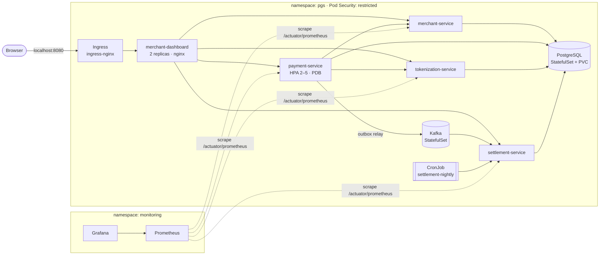

# Payment Gateway on Kubernetes


Production-style Kubernetes deployment of my
[Payment Gateway Simulator](https://github.com/amirizalrahmat0799/payment-gateway-sim) (four Spring Boot
microservices, PostgreSQL, Kafka) and its [Merchant Dashboard](https://github.com/amirizalrahmat0799/merchant-dashboard)
(React). Everything is hand-written YAML composed with Kustomize, runs on a local 3-node
[kind](https://kind.sigs.k8s.io) cluster, is monitored with Prometheus and Grafana, and is tested end to end in CI.

I built it as hands-on preparation for the **CKAD** exam. The [table below](#ckad-coverage) maps each exam domain
to the files that practise it.

## Architecture



## What's inside

| Concern | How it's handled |
|---|---|
| **Workloads** | Deployments for the stateless services, StatefulSets with `volumeClaimTemplates` for PostgreSQL and Kafka (KRaft, no ZooKeeper) |
| **Health** | `startupProbe` (Spring Boot can take a while) → `livenessProbe` → `readinessProbe` on Spring's `/actuator/health/{liveness,readiness}`. Readiness includes the DB check |
| **Zero-downtime rollouts** | `maxUnavailable: 0`, `preStop` sleep so endpoints drain before shutdown, Spring `server.shutdown=graceful`, `terminationGracePeriodSeconds: 40` |
| **Scaling** | HPA on payment-service (2–5 replicas at 70% CPU) with a scale-down stabilisation window. Safe to scale because the outbox relay uses `FOR UPDATE SKIP LOCKED` |
| **Availability** | PodDisruptionBudget keeps a payment pod up during node drains. 3-node cluster so you can actually drain one |
| **Batch** | Nightly settlement is a `CronJob` (`concurrencyPolicy: Forbid`, `timeZone`, retries). The app's own scheduler is switched off with `SETTLEMENT_CRON="-"`, and a retried run is safe because settling a date twice returns 409 |
| **Configuration** | `ConfigMap` for shared settings; per-service env vars; Kustomize `secretGenerator` for credentials, whose content hash rolls Deployments automatically when a secret changes |
| **Security** | Pod Security Admission `restricted` on the namespace; every container runs as a non-root UID with `readOnlyRootFilesystem`, all capabilities dropped and `RuntimeDefault` seccomp; ServiceAccount tokens not mounted; `enableServiceLinks: false` |
| **Network** | Default-deny NetworkPolicy, then one policy per allowed call (ingress → dashboard → APIs, payment → merchant/tokenization, backends → Postgres, producers/consumers → Kafka, Prometheus → metrics) |
| **Resources** | Requests and memory limits on every container (no CPU limits, to avoid JVM throttling); `ResourceQuota` and `LimitRange` on the namespace |
| **Observability** | Micrometer → Prometheus via a `ServiceMonitor`; business metrics (authorizations by outcome, captured and refunded volume, outbox backlog); `PrometheusRule` alerts; a provisioned Grafana dashboard |
| **CI** | Kustomize output validated with kubeconform, shellcheck on scripts, then a kind cluster built in GitHub Actions: build images, deploy, and a smoke test through the Ingress |

## Quick start

### Prerequisites

Docker Desktop with **at least 6 GB of memory**, plus `kind`, `kubectl` and `helm`. On Windows:

```powershell
winget install Kubernetes.kind Kubernetes.kubectl Helm.Helm
```

Clone the three repos side by side (the scripts expect sibling folders, or set `GATEWAY_DIR` / `DASHBOARD_DIR`):

```
IdeaProjects/
├── payment-gateway-sim/
├── merchant-dashboard/
└── payment-gateway-k8s/   ← this repo
```

### Run it (Git Bash on Windows, or any bash)

```bash
scripts/cluster-up.sh      # kind cluster + ingress-nginx + metrics-server   (~2 min)
scripts/build-images.sh    # build 5 images and load them into kind          (~5–10 min the first time)
scripts/deploy.sh          # kubectl apply -k k8s/overlays/dev, wait for rollouts
scripts/smoke-test.sh      # onboard → tokenize → charge → replay → refund → ledger
```

Open **http://localhost:8080** and create a sandbox merchant.

Optional monitoring:

```bash
scripts/monitoring.sh
kubectl -n monitoring port-forward svc/monitoring-grafana 3000:80   # http://localhost:3000, admin/admin
```

Tear down with `scripts/cluster-down.sh`.

## Things to try

```bash
# Watch the autoscaler react to load (run the smoke test in a loop in a second terminal)
kubectl -n pgs get hpa payment-service -w
while scripts/smoke-test.sh >/dev/null; do :; done

# Pod Security Admission in action: a plain debug pod is rejected in the restricted namespace...
kubectl -n pgs run debug --image=busybox:1.37 --restart=Never -- sleep 60
# ...so debug from a different namespace instead (NetworkPolicy still applies to calls into pgs)
kubectl run debug --rm -it --image=busybox:1.37 --restart=Never -- nslookup payment-service.pgs

# Zero-downtime rollout and rollback
kubectl -n pgs rollout restart deployment/payment-service
kubectl -n pgs rollout status deployment/payment-service
kubectl -n pgs rollout history deployment/payment-service
kubectl -n pgs rollout undo deployment/payment-service

# Drain a node and watch the PodDisruptionBudget protect payment-service
# (Postgres/Kafka volumes use kind's local-path storage, so those pods wait for their node to come back.)
kubectl drain pgs-worker --ignore-daemonsets --delete-emptydir-data
kubectl uncordon pgs-worker

# Run the nightly settlement now instead of waiting for 00:05 UTC
kubectl -n pgs create job settle-now --from=cronjob/settlement-nightly
kubectl -n pgs logs job/settle-now

# Debugging
kubectl -n pgs get events --sort-by=.lastTimestamp
kubectl -n pgs describe pod -l app.kubernetes.io/name=payment-service
kubectl -n pgs logs deploy/settlement-service --tail=50
kubectl -n pgs top pods
```

## CKAD coverage

| CKAD domain | Where it's practised |
|---|---|
| **Application Design and Build**: multi-container/ephemeral volumes, Jobs & CronJobs, workload types | [`settlement-cronjob.yaml`](k8s/base/apps/settlement-cronjob.yaml), [`postgres.yaml`](k8s/base/data/postgres.yaml) & [`kafka.yaml`](k8s/base/data/kafka.yaml) (StatefulSets, PVCs), `emptyDir` for `/tmp` in every pod |
| **Application Deployment**: rolling updates, rollbacks, scaling, Kustomize, Helm | [`apps/*.yaml`](k8s/base/apps) (strategy), [`payment-service-scaling.yaml`](k8s/base/apps/payment-service-scaling.yaml) (HPA), [`k8s/overlays/dev`](k8s/overlays/dev) (Kustomize), [`monitoring.sh`](scripts/monitoring.sh) (Helm) |
| **Application Observability and Maintenance**: probes, logging, monitoring, debugging | Startup/liveness/readiness probes in every Deployment, [`k8s/monitoring`](k8s/monitoring) (ServiceMonitor, alerts, dashboard), "Things to try" above |
| **Application Environment, Configuration and Security**: ConfigMaps, Secrets, SecurityContexts, ServiceAccounts, resources, quotas | [`config.yaml`](k8s/base/config.yaml), `secretGenerator` in the [overlay](k8s/overlays/dev/kustomization.yaml), pod/container `securityContext`, [`quota.yaml`](k8s/base/platform/quota.yaml), [`namespace.yaml`](k8s/overlays/dev/namespace.yaml) (Pod Security Admission) |
| **Services and Networking**: Services, Ingress, NetworkPolicies | ClusterIP & headless Services, [`ingress.yaml`](k8s/base/ingress.yaml), [`network-policies.yaml`](k8s/base/platform/network-policies.yaml) |

## Repository layout

```
kind/cluster.yaml                1 control plane + 2 workers, port 8080 → ingress
k8s/
├── base/
│   ├── platform/                ResourceQuota, LimitRange, NetworkPolicies
│   ├── data/                    PostgreSQL and Kafka StatefulSets
│   ├── apps/                    4 services, dashboard, HPA + PDB, settlement CronJob
│   ├── config.yaml              shared ConfigMap
│   └── ingress.yaml
├── overlays/dev/                namespace (PSA restricted), dev secrets, image tags
└── monitoring/                  Helm values, ServiceMonitor, PrometheusRule, Grafana dashboard
scripts/                         cluster-up, build-images, deploy, smoke-test, monitoring, cluster-down
```

## Notes and trade-offs

- **Secrets in git**: the dev overlay commits *development-only* credentials so the project runs out of the box.
  A real environment would use External Secrets Operator or Sealed Secrets.
- **Single Postgres / single Kafka broker**: fine for a laptop. In production I'd use a managed database or
  CloudNativePG, and Strimzi with 3 brokers.
- **NetworkPolicies** are only enforced if the CNI supports them. Recent kind releases do; on older ones, install
  Calico to see them take effect.
- **Images** are built locally and loaded with `kind load`, so no registry is needed. Publishing to GHCR and
  adding a `prod` overlay that points at it would be the next step.

## Roadmap

- [ ] Publish images to GHCR from the app repos and add a `prod` overlay
- [ ] GitOps with Argo CD
- [ ] Kafka and Postgres via operators (Strimzi, CloudNativePG)
- [ ] Autoscale on a business metric (requests/s) with KEDA or the Prometheus adapter

## License

[MIT](LICENSE)
